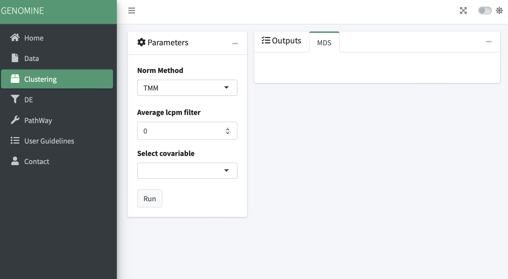

# GenoMine
Shiny app for data exploration of RNAseq data. (work in progress)

## Home:

The application is splited in 4 main steps:

* First: upload your expression data and clinical info data and explore your data.
* Second: Select your normalitzation model and explore clustering using multiple variables from your clinical info.
* Third: Perform a diferential expression analysis using diferent models.
* Fourth: Pathway analysis using diferent GO from yout DE results.

## Data:

In this section the user can upload their experssion data in raw counts and the clinical or variable data from their samples (tab separated columns).

* For the counts expression files, genes must be on the rows and samples on columns.
* Clinical/variable info data must be samples on the rows and variables on columns.

Please select if your data have headers or not on using the selector button.

After uploading the data a summery of your data will appear on Summary Info section, a table with your sample info can be visualize in the Table info secction and the table with your counts can be visualize in Counts section.

## Clustering:

Normalization of your counts using 4 different model (TMM, TMMwsp, RLE, upperquartile) or none.
Count matrix can be filtered by a minimum of logCPM mean from all samples.
Choose varibale from your info data to colour the clustering groups

Differential Expression:

Select between two diferent models to perform the DE analysis (DESeq2 or LIMMA).
You can add a minimun of counts to filter none or low expression genes.
Select the covariable from your info data to apply the DE analysis.

There are two ouptuts:

* MA plot, with the diferential expression results.
* Boxplot per gene to evaluate the DE results and select variables from info data to see the diferences.

Pathway analysis:

A table from the DE analysis can be uploaded.

The user can chose the filters to select the group of genes using DE information (logFC and p-value)
Can select which GO use or make the analysis with all.

